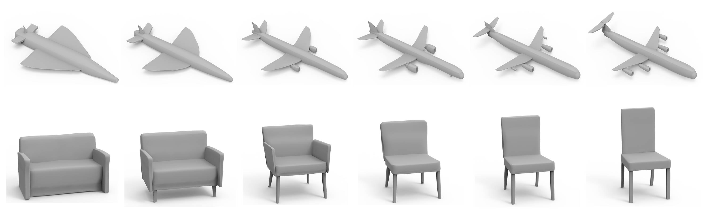

# [SDM-NET: Deep Generative Network for Structured Deformable Mesh](http://geometrylearning.com/sdm-net/)
Lin Gao, Jie Yang, Tong Wu, Yu-Jie Yuan, Hongbo Fu, Yu-Kun Lai, Hao Zhang


## Requirements
1. Requirements for SDM-NET
  - NVIDIA GPU (larger than 8G) + CUDA 9.0 + cuDNN 7.1 + Tensorflow 1.12.0 + CMake 3.15
  - ```pip install -r requirement.txt```

2. Requirements for Preprocess and Postprocess
  - [TOMLAB](tomopt.com/tomlab/) with a business license.
  - [GUROBI](https://www.gurobi.com/) with a license to active larger optimizations.
  - [Matlab 2018b](https://www.mathworks.com/)
  
    note: some dependencies only run in the windows platform.

## Access to Data

Please fill in this [form](https://forms.gle/H5bqhFEiHaC4K13s6) to download the data.

This link provides processed partical [ShapeNet](https://www.shapenet.org/) and [ModelNet](https://modelnet.cs.princeton.edu/) data for four object categories used in the paper: monitor, mug, guitar, car. Other dataset will be checked and released as soon as possible.
The directory tree looks like this:
```
guitar
├── id0
│   ├── part1.obj
│   ├── part2.obj
│   ├── part3.obj
│   └── model_normalized.obj
└── id1
    ├── part1.obj
    ├── part2.obj
    ├── part3.obj
    └── model_normalized.obj
``` 

## Preprocess

1. Run ```GetTransformedCube.m``` to get transformed a mini bounding box which will be used as source shape in non-rigid registration for each partial 3D model.
2. Run ```SupportAnalysis.m``` to extract structure information from the partial ```obj``` files producing a corresponding ```code.mat``` for each 3D model.
3. Run ```register.m``` to perform non-rigid registrations from transformed mini bounding boxes to original partial 3D models.
4. Run ```generate_data.m``` to extract deformation information between source shapes and registered shapes with a ```vaefeature.mat``` file produced which will be used as the input of ```SDM-NET```.

   An example is shown in ```Pipeline.m```.

## Training & Testing

1. Training

   Run ```python ./code/train.py --model guitar```

   My case study of 588 models
   Run ```python ./python/train.py --model car```
   150000 epoch (modified default epoch in the train.py )
   Run ```python ./python/train.py --model car --output_dir ./05191042_7925joint_0-l0_10.0-l2_10.0-l3_1.0-l4_0.001-model_car-trcet_0.75```
2. Testing (Decoding shapes, Interpolation between shapes, Generating shapes)

   Run ```python ./code/test.py --output_dir path(for the training output dir)```

   My case study of 588 models
   Run ```python ./python/test.py --output_dir ./05191042_7925joint_0-l0_10.0-l2_10.0-l3_1.0-l4_0.001-model_car-trcet_0.75```
   Run ```python ./python/test.py --output_dir ./05191042_7925joint_0-l0_10.0-l2_10.0-l3_1.0-l4_0.001-model_car-trcet_0.75 --interid '3' '11'``` # two number with '' and space


## Postprocess
1. Run ```GetOptimizedObj.m``` to refine the structure of the decoded 3D models.

demos
% two examples of the structure optimization mentioned in paper
ReconstructFromCodeMixInteger('.\DATA\plane\output', 'plane');
ReconstructFromCodeMixInteger('.\DATA\chair\output', 'chair');

## Citation
If you use our code or method in your work, please cite the following:
```
@article {gaosdmnet2019,
    author = {Gao, Lin and Yang, Jie and Wu, Tong and Yuan, Yu-Jie and Fu, Hongbo and Lai, Yu-Kun and Zhang, Hao(Richard)},
    title = {{SDM-NET}: Deep Generative Network for Structured Deformable Mesh},
    journal = {ACM Transactions on Graphics (Proceedings of ACM SIGGRAPH Asia 2019)},
    year = {2019},
    volume = 38,
    pages = {243:1--243:15},
    number = 6 
}
```
